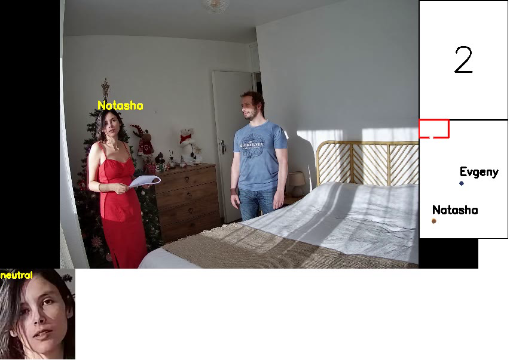

# Проектная работа МФТИ - cv_tracking
Анализ видео с камер наблюдения в клинике с дальнейшей интеграцией с учетной системой и сбора статистики

- Подробное описание проекта можно найти в [ноутбуке разработки](https://colab.research.google.com/drive/1C6qhr3qGnRfvE8HPyjo9KgK0RXPHhGjX?usp=sharing)
- Оригинальное видео работы программы /result/output.mp4

# Требования:
- Unix/Windows
- С++ >=14
- OpenCV >= 3.0
- ONNXRUNTIME

Тестирование проводилось под Microsoft Visual Studio Community 2022 (64-bit), 
на других платформах также должно работать, т.к. все компонетны являются кросс платформенными

# Для сборки можно воспользоваться CMake
- cmake -B build -D OpenCV_INCLUDE_DIRS=/.../ ONNXRUNTIME_ROOT=/.../ .
- cmake --build build

# Настройка
- Необходимо предварительно настроить model/config.h -> указать все требуемые пути
- Разместить папку с фотографиями сотрудников для предварительного составления вектора особенностей лица
- необходимо настроить источник видео, прописать формат клиники, ее кабинетов и указать точки соответствия углов изображений с камеры, реальному положению кабинета

